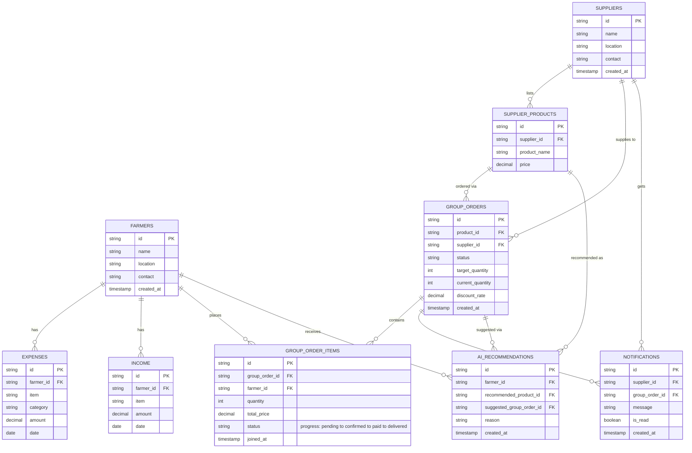

# Agri Tech Database — Entity Relationship Diagram (v2)

This replaces the earlier `agritech-erd.pdf`. It reflects the current schema
(`schema.sql`): **farmers** and **suppliers** are the two central hub
entities, every id is a `string` (UUID), and every relationship is drawn as
its own separate labelled line (no shared/overlapping arrows).

## What changed vs. the old diagram

1. **Supplier ↔ group order visibility** — `group_orders.supplier_id` is now
   a direct foreign key to `suppliers` (not just via `supplier_products`), so
   a supplier can list every group order raised on their products with one
   query (see `supplier_group_orders_view` in `schema.sql`).
2. **Farmer order progress** — `group_order_items.status` tracks each
   farmer's own progress through a group order
   (`pending → confirmed → paid → delivered`, or `cancelled`). See
   `farmer_order_progress_view` in `schema.sql`.
3. **Farmers & suppliers are the two hub entities** — every other table
   hangs off one or both of them; they are drawn first/centrally above.
4. **All ids are `string` (UUID)** — every `PK`/`FK` column uses
   `VARCHAR(36)` with `gen_random_uuid()` as the default, instead of
   `SERIAL`/`INTEGER`.
5. **One line per relationship** — each relationship above is a single
   labelled edge; nothing is merged or crossed the way the old PDF drew
   `ordered via` / `supplies to` / `triggers` together.

## Regenerating / editing this diagram

The Mermaid source lives in [`erd.mmd`](./erd.mmd). Edit it directly, or
paste it into the [Mermaid Live Editor](https://mermaid.live) to export a
PNG/SVG. GitHub renders the block above automatically on this page and in
any PR that touches it.
